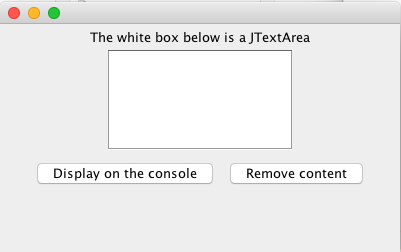
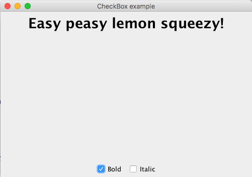
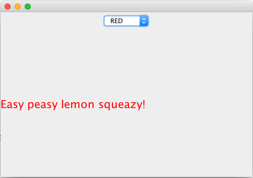
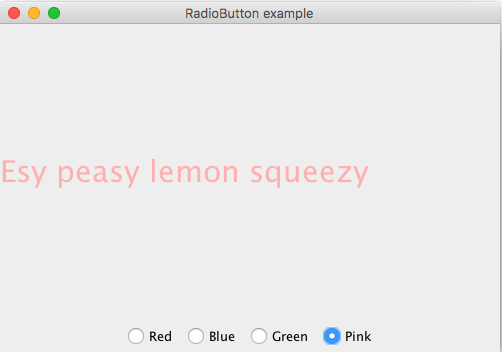
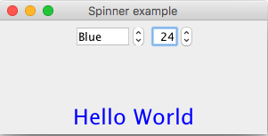
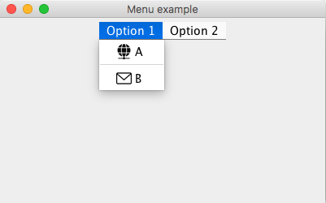
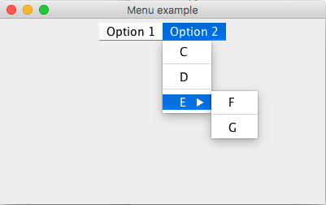

# Java_swing

Some basic application examples of java swing components.

## JTextArea

This example includes a text box and two buttons. One button displays the text on the console, and the other button removes the content of the text area.

## CheckBox

This example displays a JLabel containing a message. By checking and un-checking the two checkboxes the format of the message is modified.

## ComboBox

This example displays a JLabel containing a message. By selecting the options from the ComboBox, the format of the message is modified.

## RadioButton

This example displays a JLabel containing a message. By selecting each of the radiobuttons, the format of the message is modified accordingly.

## Spinner

This example displays two spinners on the top margin, and a JLabel containing a message on the bottom side. By modifying each of the spinners, the format of the message is modified accordingly.

## Menu

In this example, a Menu is added to the frame. The Menu has two options, 'Option 1' and 'Option 2', each having its own items and sub-items. Items from 'Option 1' have an icon associated to the item. 

